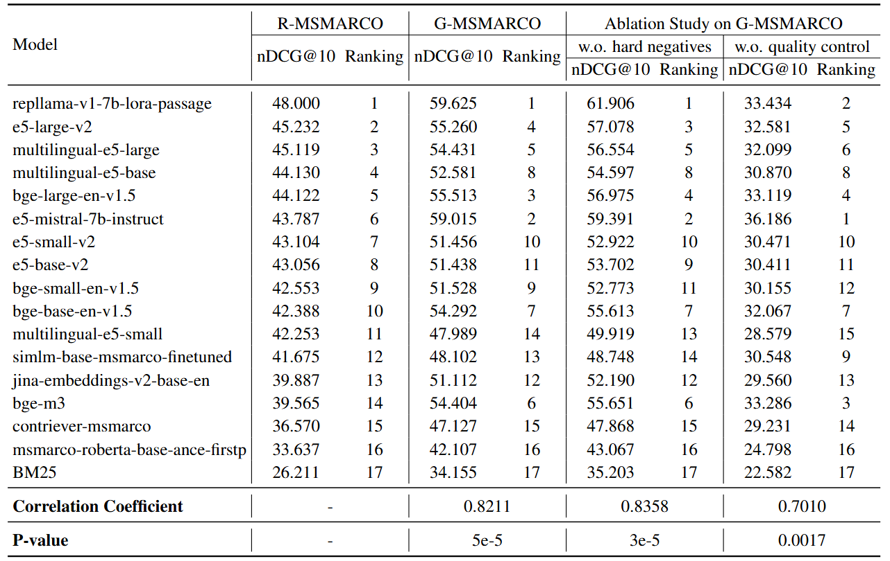
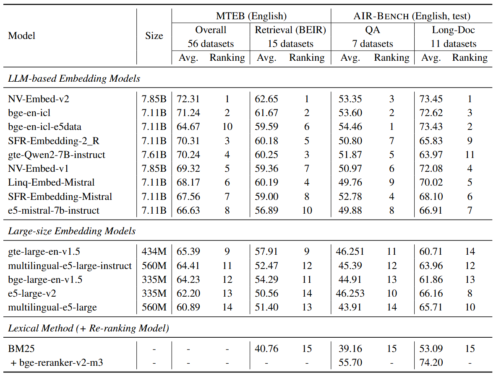
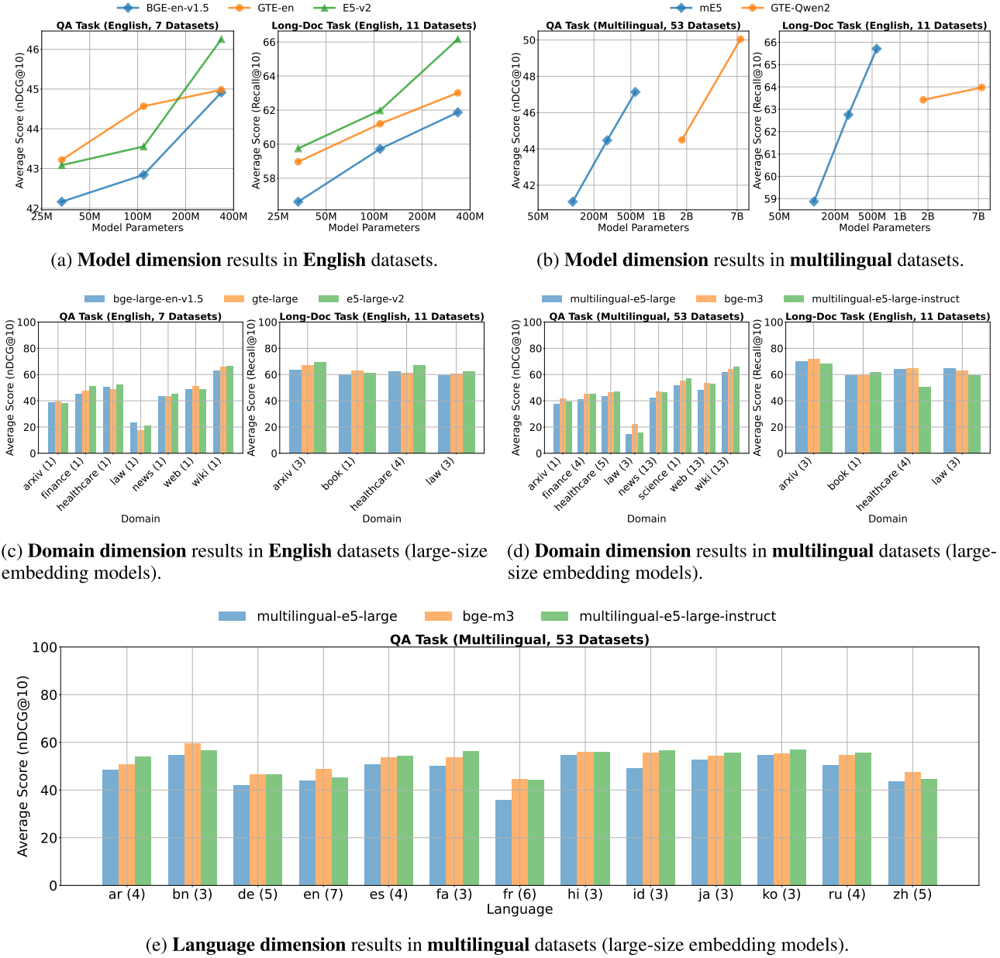
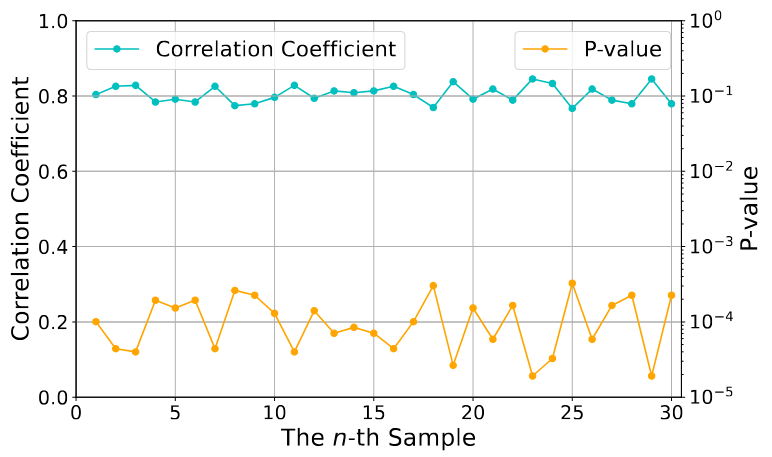

# Available Analysis Results on AIR-Bench

- [Available Analysis Results on AIR-Bench](#available-analysis-results-on-air-bench)
  - [Outline](#outline)
  - [Consistency with Human-labeled Data](#consistency-with-human-labeled-data)
  - [Zero-shot Evaluation Results](#zero-shot-evaluation-results)
  - [Distinguishing Models](#distinguishing-models)
  - [Abalation Study](#abalation-study)
    - [Influence of Hard Negatives](#influence-of-hard-negatives)
    - [Necessity of Quality Control](#necessity-of-quality-control)
    - [Robustness of Generation Pipeline](#robustness-of-generation-pipeline)
  - [Models List](#models-list)

## Outline

Here only lists some brief analysis results on AIR-Bench (*24.05 version*). *The technical report is coming soon*. Please stay tuned for updates!

- **The generated dataset is highly consistent with the human-labeled dataset**. The Spearman’s rank correlation between the 17 mainstream models' rankings on the raw MSMARCO passage ranking dataset (<u>*R-MSMARCO*</u>) and the generated MSMARCO passage ranking dataset (<u>*G-MSMARCO*</u>) is 0.8211 with `p-value = 5e-5`. Refer to [Fig 1](#consistency-with-human-labeled-data) for more details.
- **More MTEB-related data in the training of embedding model will probably cause the degradation of generalization ability of embedding models**. According to [2409.15700](https://arxiv.org/abs/2409.15700), BAAI/bge-en-icl uses more MTEB-related training data than BAAI/bge-en-icl-e5data and achieves better results on MTEB/BEIR than bge-en-icl-e5data. However, BAAI/bge-en-icl-e5data achieves better results on AIR-Bench than BAAI/bge-en-icl. This indicates that the embedding model trained with more MTEB-related data may have a better performance on MTEB/BEIR but a worse performance on AIR-Bench. AIR-Bench provides a new benchmark for evaluating the generalization ability of embedding models. Refer to [Fig 2](#zero-shot-evaluation-results) for more details.
- **AIR-Bench is a challenging benchmark which can distinguish models in different dimensions**. For model dimension, BM25 performs worse than embedding models; embedding models generally perform worse than re-ranking models; small-size embedding models generally perform worse than large-size embedding models. For domain dimension, no model is able to achieve the best performance on all domains. For language dimension, no model is able to achieve the best performance on all languages. Refer to [Fig 3](#distinguishing-models) for more details.
- **Abalation study on the generation pipeline of AIR-Bench**. The hard negatives will improve the difficulty of AIR-Bench but not significantly influcence the consistency between the generated testing data and the human-labeled testing data. The quality control is necessary for the generation pipeline of AIR-Bench. The generation pipeline of AIR-Bench is robust enough to generate consistent testing data. Refer to [Fig 1](#consistency-with-human-labeled-data) and [Fig 4](#robustness-of-generation-pipeline) for more details.

## Consistency with Human-labeled Data

Fig 1. Consistency Analysis between the generated testing data and the human-labeled testing data.

## Zero-shot Evaluation Results

Fig 2. Comparison of embedding models’ performances on MTEB/BEIR and AIR-Bench.

## Distinguishing Models

Fig 3. AIR-Bench is a challenging benchmark and can distinguish models in different dimensions, including model dimension, domain dimension, and language dimension.

## Abalation Study

### Influence of Hard Negatives

Refer to [Fig 1](#consistency-with-human-labeled-data) for more details.

### Necessity of Quality Control

Refer to [Fig 1](#consistency-with-human-labeled-data) for more details.

### Robustness of Generation Pipeline

## Models List

The following table lists the models used in the analysis.

| Model                            | Size  |                          Model Link                          |
| -------------------------------- | :---: | :----------------------------------------------------------: |
| *Lexical Method*                 |       |                                                              |
| BM25                             |   -   |            https://github.com/castorini/pyserini             |
| *English Embedding Models*       |       |                                                              |
| bge-small-en-v1.5                | 33.4M |        https://huggingface.co/BAAI/bge-small-en-v1.5         |
| bge-base-en-v1.5                 | 109M  |         https://huggingface.co/BAAI/bge-base-en-v1.5         |
| bge-large-en-v1.5                | 335M  |        https://huggingface.co/BAAI/bge-large-en-v1.5         |
| bge-en-icl                       | 7.11B |            https://huggingface.co/BAAI/bge-en-icl            |
| bge-en-icl-e5data                | 7.11B |                   Temporarily unavailable                    |
| e5-small-v2                      | 33.4M |         https://huggingface.co/intfloat/e5-small-v2          |
| e5-base-v2                       | 109M  |          https://huggingface.co/intfloat/e5-base-v2          |
| e5-large-v2                      | 335M  |         https://huggingface.co/intfloat/e5-large-v2          |
| gte-small                        | 33.4M |          https://huggingface.co/thenlper/gte-small           |
| gte-base                         | 109M  |           https://huggingface.co/thenlper/gte-base           |
| gte-large                        | 335M  |          https://huggingface.co/thenlper/gte-large           |
| gte-large-en-v1.5                | 434M  |     https://huggingface.co/Alibaba-NLP/gte-large-en-v1.5     |
| jina-embeddings-v2-base-en       | 137M  |   https://huggingface.co/jinaai/jina-embeddings-v2-base-en   |
| repllama-v1-7b-lora-passage      | 6.74B | https://huggingface.co/castorini/repllama-v1-7b-lora-passage |
| SFR-Embedding-Mistral            | 7.11B |   https://huggingface.co/Salesforce/SFR-Embedding-Mistral    |
| SFR-Embedding-2\_R               | 7.11B |     https://huggingface.co/Salesforce/SFR-Embedding-2_R      |
| NV-Embed-v1                      | 7.85B |          https://huggingface.co/nvidia/NV-Embed-v1           |
| Linq-Embed-Mistral               | 7.11B |  https://huggingface.co/Linq-AI-Research/Linq-Embed-Mistral  |
| simlm-base-msmarco-finetuned     | 110M  | https://huggingface.co/intfloat/simlm-base-msmarco-finetuned |
| msmarco-roberta-base-ance-firstp | 125M  | https://huggingface.co/sentence-transformers/msmarco-roberta-base-ance-firstp |
| contriever-msmarco               | 109M  |      https://huggingface.co/facebook/contriever-msmarco      |
| *Multilingual Embedding Models*  |       |                                                              |
| bge-m3                           | 568M  |              https://huggingface.co/BAAI/bge-m3              |
| bge-multilingual-gemma2          | 9.24B |     https://huggingface.co/BAAI/bge-multilingual-gemma2      |
| e5-mistral-7b-instruct           | 7.11B |    https://huggingface.co/intfloat/e5-mistral-7b-instruct    |
| multilingual-e5-small            | 118M  |    https://huggingface.co/intfloat/multilingual-e5-small     |
| multilingual-e5-base             | 278M  |     https://huggingface.co/intfloat/multilingual-e5-base     |
| multilingual-e5-large            | 560M  |    https://huggingface.co/intfloat/multilingual-e5-large     |
| multilingual-e5-large-instruct   | 560M  | https://huggingface.co/intfloat/multilingual-e5-large-instruct |
| gte-multilingual-base            | 305M  |   https://huggingface.co/Alibaba-NLP/gte-multilingual-base   |
| bce-embedding-base\_v1           | 278M  |  https://huggingface.co/maidalun1020/bce-embedding-base_v1   |
| gte-Qwen2-1.5B-instruct          | 1.78B |  https://huggingface.co/Alibaba-NLP/gte-Qwen2-1.5B-instruct  |
| gte-Qwen2-7B-instruct            | 7.61B |   https://huggingface.co/Alibaba-NLP/gte-Qwen2-7B-instruct   |
| *Re-ranking Models*              |       |                                                              |
| bge-reranker-v2-m3               | 568M  |        https://huggingface.co/BAAI/bge-reranker-v2-m3        |
