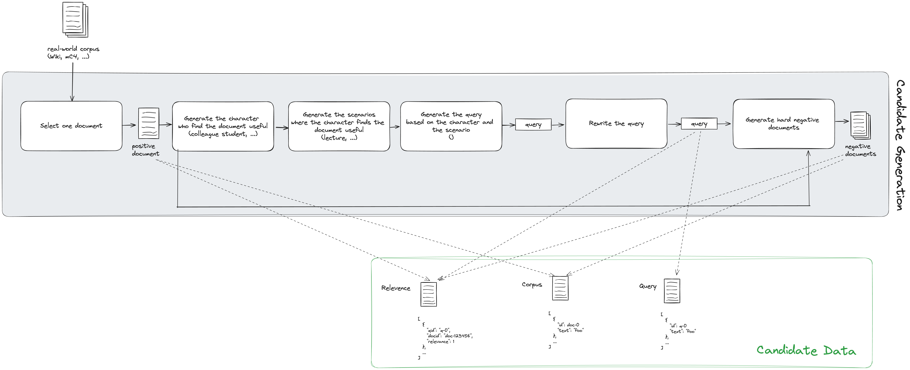
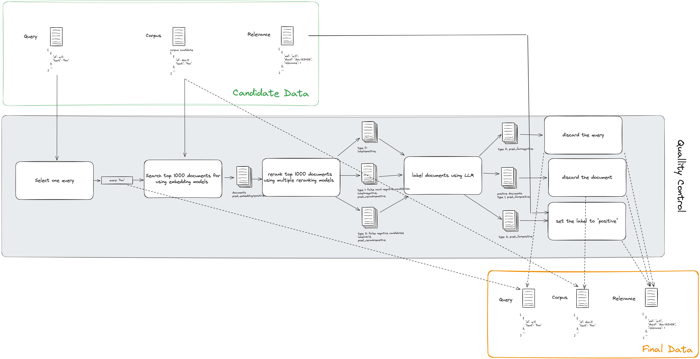

## Data Generation

- [Data Generation](#data-generation)
  - [Task Type](#task-type)
  - [Domain & Language](#domain--language)
  - [Pipeline](#pipeline)
    - [Corpus Preparation](#corpus-preparation)
    - [Candidate Generation](#candidate-generation)
    - [Quality Control](#quality-control)
    - [Quality Verification](#quality-verification)

### Task Type

As AIR-Bench focuses on the retrieval and RAG benchmarks, we include two tasks. 
- Question-Answering (QA) is the classic task of finding answers for a given question.
- Inner-Document retrieval (Inner-Doc) is the task we proposed to evaluate the models' performance in the RAG scenario. The task is to find the related document chunk (which are usually long-text) from the whole corpus given a question.

### Domain & Language
AIR-Bench is targeting at automatically generating testing data without human intervention. Therefore, it is able to instantly support the evaluation of new domains at a very small cost with the help of LLMs.

As for the initial version `AIR-Bench_24.04`, we’ve covered 8 domains (including Wiki, Web, Healthcare, Law, Arxiv, News, Finance, Book) and 2 languages (including English and Chinese). There are 28 datasets in total.

As for the latest version `AIR-Bench_24.05`, we’ve covered 9 domains (including Wiki, Web, Healthcare, Law, Arxiv, News, Finance, Book, Science) and 13 languages (including English, Chinese, Spanish, French, German, Russian, Japanese, Korean, Arabic, Persian, Indonesian, Hindi, Bengali). There are 69 datasets in total.

### Pipeline

Note that we use `gpt-4-1106-preview` as the LLM through the generation pipeline.


#### Corpus Preparation

For QA task, we use the real-world datasets as the corpus, such as Wikipedia, mC4, etc.

For Long-Doc task, we firstly select the long documents, such as ArXiv papers, books, etc. Then we use the `SimpleNodeParser` from the [LlamaIndex](https://github.com/run-llama/llama_index/tree/main) to split the long document to fixed-size chunks (`chunk_size=200`, `chunk_overlap=50`) as the corpus.

#### Candidate Generation 

We use LLMs to generate query and documents following the procedure below.



1. Select one document from the raw corpus
2. Generate the characters who will find the document useful.
3. Generate the scenarios in which the character may find the document useful.
4. Generate the query based on the specific character and scenario.
5. Rewrite the query for multiple times to avoid the duplicated texts as in the raw corpus.
6. Generate hard negative documents based on the given query and the positive document.
7. Repeat Step 1-6

#### Quality Control



Given a candidate data, we run the following steps to control the quality:

1. Use the embedding model to search top-1000 relevant documents from the corpus for each query.
2. Use multiple rerankers to rerank the top-1000 relevant documents. Based on the raw label from the previous candidate generation process and the prediction results from the reranker. We categorize the documents into three groups. 
    - Type 0 are the documents that are labeled as relevant to the query. We don't filter these documents by either embedding or reranking model.
    - Type 1 are the documents that are labeled as relevant but are generated as hard negative documents. 
    - Type 2 are the documents that are generated as positive documents for other queries but labeled by the models as relevant.
    - For the other documents, we skip them and don't take any action because the models' predictions are consistent with our expectation.

    |                | `relevance` = 1 | `relevance` = 0 | `relevance` = `N/A` |
    | -------------- |-----------------|---------------|-------------------|
    | pred = `pos`   | Type 0          | Type 1        | Type 2            |
    | pred = `neg`   | Type 0          | Skip          | Skip              |
3. Use the LLM as labeler to label the documents of the three types.
    - Type 0: when the LLM prediction is negative, it means the generated query does not match the relevant document candidate well and therefore we drop the generated query. When the prediction is positive, which is the same as our expectation, we don't need to take any action. 
    - Type 1: when the LLM prediction is positive, it means the generated hard negative sample is relevant to the query and therefore we remove the document from the corpus. When the prediction is negative, which is the same as the expectation, we keep it as it is.
    - Type 2: when the LLM prediction is positive, it means there are the document is relevant to the query although it is used to generate the another query. In this case, we change the golden truth to `relevance`=1. If the prediction is negative, it meets our expectation and we keep it as it is. 

    |                | Type 0        | Type 1           | Type 2                    |
    | -------------- |---------------|------------------|---------------------------|
    | pred = `pos`   | Skip          | discard document | Change to `relevance` = 1 |
    | pred = `neg`   | discard query | Skip             | Skip                      |
4. Repeat step 1-3 for each query.

### Quality Verification
To verify the preference of AIR-Bench is aligned with the human, we compared the ranking of 17 mainstream models on the data generated by AIR-Bench and those labelled by human. In the MS MARCO Dev dataset, we observed that generated data is aligned with the human’s preference with Spearman correlation efficient = 0.82 and p_value = 5e-5.

| Model                            | Raw MSMARCO | Rank_Raw_MSMARCO | Generated MSMARCO | Rank_Generated MSMARCO |
| -------------------------------- | ----------- |------------------| ----------------- |--------|
| repllama-v1-7b-lora-passage      | 48          | 1                | 59.625            | 1      |
| e5-large-v2                      | 45.232      | 2                | 55.26             | 4      |
| multilingual-e5-large            | 45.119      | 3                | 54.431            | 5      |
| multilingual-e5-base             | 44.13       | 4                | 52.581            | 8      |
| bge-large-en-v1.5                | 44.122      | 5                | 55.513            | 3      |
| e5-mistral-7b-instruct           | 43.787      | 6                | 59.015            | 2      |
| e5-small-v2                      | 43.104      | 7                | 51.456            | 10     |
| e5-base-v2                       | 43.056      | 8                | 51.438            | 11     |
| bge-small-en-v1.5                | 42.553      | 9                | 51.528            | 9      |
| bge-base-en-v1.5                 | 42.388      | 10               | 54.292            | 7      |
| multilingual-e5-small            | 42.253      | 11               | 47.989            | 14     |
| simlm-base-msmarco-finetuned     | 41.675      | 12               | 48.102            | 13     |
| jina-embeddings-v2-base-en       | 39.887      | 13               | 51.112            | 12     |
| bge-m3                           | 39.565      | 14               | 54.404            | 6      |
| contriever-msmarco               | 36.57       | 15               | 47.127            | 15     |
| msmarco-roberta-base-ance-firstp | 33.637      | 16               | 42.107            | 16     |
| BM25                             | 26.211      | 17               | 34.155            | 17     |


**Consistency Analysis**: The Spearman's rank correlation coefficient is 0.8211 with `p_value = 5e-5`, which indicates that the generated dataset is highly consistent with the original dataset.

```python
from scipy.stats import spearmanr

rank1 = [1, 2, 3, 4, 5, 6, 7, 8, 9, 10, 11, 12, 13, 14, 15, 16, 17]
rank2 = [1, 4, 5, 8, 3, 2, 10, 11, 9, 7, 14, 13, 12, 6, 15, 16, 17]

correlation, p_value = spearmanr(rank1, rank2)
print(correlation, p_value)
# correlation = 0.8210784313725491
# p_value (alpha=0.05) = 5.346351701144889e-05
```

[//]: # (### Codes)

[//]: # ()
[//]: # (Here is the sample code snippet for generating the datasets)

[//]: # ()
[//]: # (```python)

[//]: # (def generate_dataset&#40;corpus, num_queries, task_type&#41;:)

[//]: # (    # Generate Triplets)

[//]: # (    triplets = [])

[//]: # (    documents = sample&#40;corpus, n=num_queries&#41;)

[//]: # (    for d in documents:)

[//]: # (        # Generate Query)

[//]: # (        q = generate_query&#40;d&#41;)

[//]: # (        # Generate Hard Negative)

[//]: # (        if task_type == 'QA':)

[//]: # (            hn = generate_hard_negative&#40;q, d&#41;)

[//]: # (        else:)

[//]: # (            hn = None)

[//]: # (        # Add New Triplet)

[//]: # (        triplets.append&#40;&#40;q, d, hn&#41;&#41;)

[//]: # ()
[//]: # (    # Build Dataset)

[//]: # (    dataset = build_dataset&#40;corpus, triplets&#41;)

[//]: # ()
[//]: # (    # Quality Control)

[//]: # (    new_dataset = quality_control&#40;dataset&#41;)

[//]: # (    return new_dataset)

[//]: # ()
[//]: # (def generate_query&#40;document&#41;:)

[//]: # (    pass)

[//]: # ()
[//]: # (def generate_hard_negative&#40;query, document&#41;:)

[//]: # (    pass)

[//]: # ()
[//]: # (def quality_control&#40;dataset&#41;:)

[//]: # (    pass)

[//]: # (```)